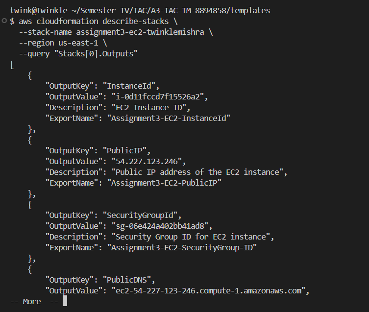

# Assignment 3 - AWS CloudFormation: EC2 and RDS Deployment

## Info
- **Name**: Twinkle Mishra
- **Student ID**: 8894858

## Objective
To deploy an AWS infrastructure using CloudFormation that includes:
- A VPC with public/private subnets
- An EC2 instance accessible via public IP
- An RDS MySQL database publicly accessible

## Folder Structure
```
A3-IAC-TM-8894858/
├── templates/
│   ├── networking-template.yaml
│   ├── ec2-template.yaml
│   ├── rds-template.yaml
├── screenshots/
└── assignment3-keypair.pem
```

## Steps Performed

### 1. Deploy Networking Infrastructure
```bash
aws cloudformation create-stack   --stack-name assignment3-networking-twinklemishra   --template-body file://networking-template.yaml   --region us-east-1   --capabilities CAPABILITY_NAMED_IAM
```
#### VPC and Subnets Created


#### Internet Gateway + Route Table


#### Stack Events and Outputs


---

### 2. Deploy EC2 Instance
```bash
aws cloudformation create-stack   --stack-name assignment3-ec2-twinklemishra   --template-body file://ec2-template.yaml   --parameters ParameterKey=AMIId,ParameterValue=ami-0c02fb55956c7d316                ParameterKey=InstanceType,ParameterValue=t2.micro                ParameterKey=KeyPairName,ParameterValue=assignment3-keypair   --region us-east-1   --capabilities CAPABILITY_NAMED_IAM
```

#### Stack Events and Outputs


#### Instance Running + Public Web Output


#### CLI Verification
```bash
aws ec2 describe-instances --region us-east-1
```


---

### 3. Deploy RDS Instance
```bash
aws cloudformation create-stack   --stack-name assignment3-rds-twinklemishra   --template-body file://rds-template.yaml   --region us-east-1   --capabilities CAPABILITY_NAMED_IAM
```

#### Stack Events and Outputs


#### RDS Running + CLI Verification


```bash
aws cloudformation describe-stacks   --stack-name assignment3-rds-twinklemishra   --query "Stacks[0].Outputs[?OutputKey=='RDSEndpoint'].OutputValue"   --output text
```


---

### 4.Stack Overview (All Stacks)


---

## Notes
- Region: `us-east-1`
- KeyPair: `assignment3-keypair.pem`
- Security Groups allow SSH (EC2) and MySQL (RDS)